# Retainr

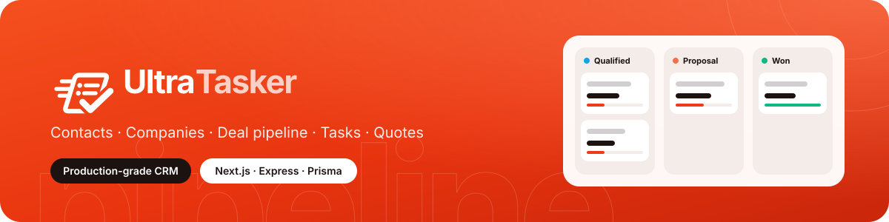

A proposal-to-renewal workspace for performance-marketing agencies. Retainr connects **lead tracking, scoped proposals, onboarding handoffs, retainer health, and renewal follow-up** on a typed Next.js, Express, Firebase, and PostgreSQL stack.

> Formerly a MERN task-manager demo. Fully rebuilt: TypeScript everywhere, Prisma ORM behind repositories, dependency-injected services, Zod-validated boundaries, and a three-layer frontend data architecture (`api/` → `hooks/` → `components/`).

## Screenshots

A light, warm-neutral UI with a red-orange accent. The public website uses big display typography and red hero panels; the workspace uses a floating sidebar.

**Website** — `/`, `/features`, `/pricing`, `/security`, `/about`, `/contact`

| | |
|---|---|
| 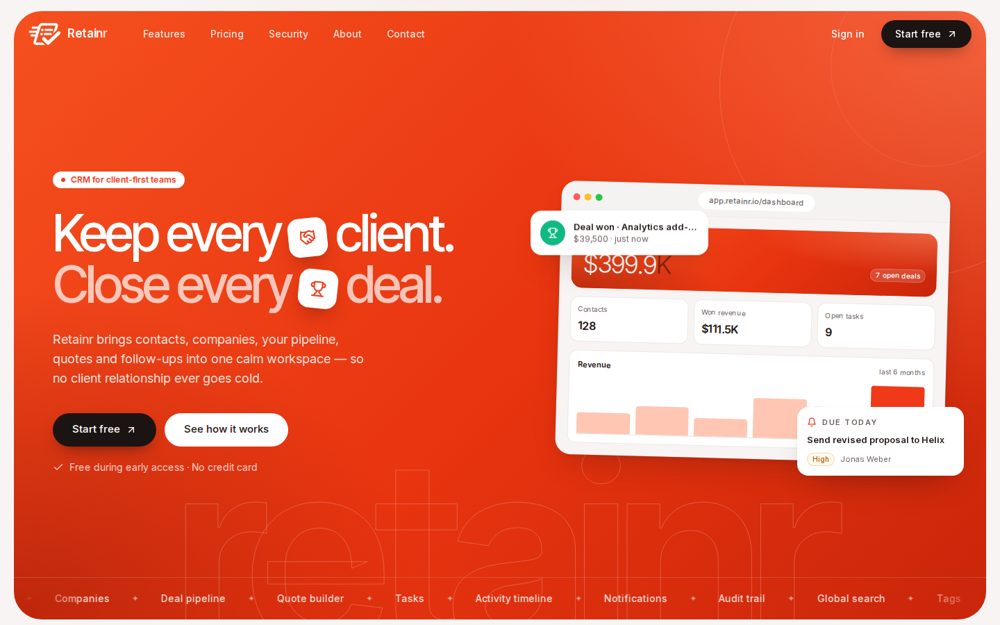 | 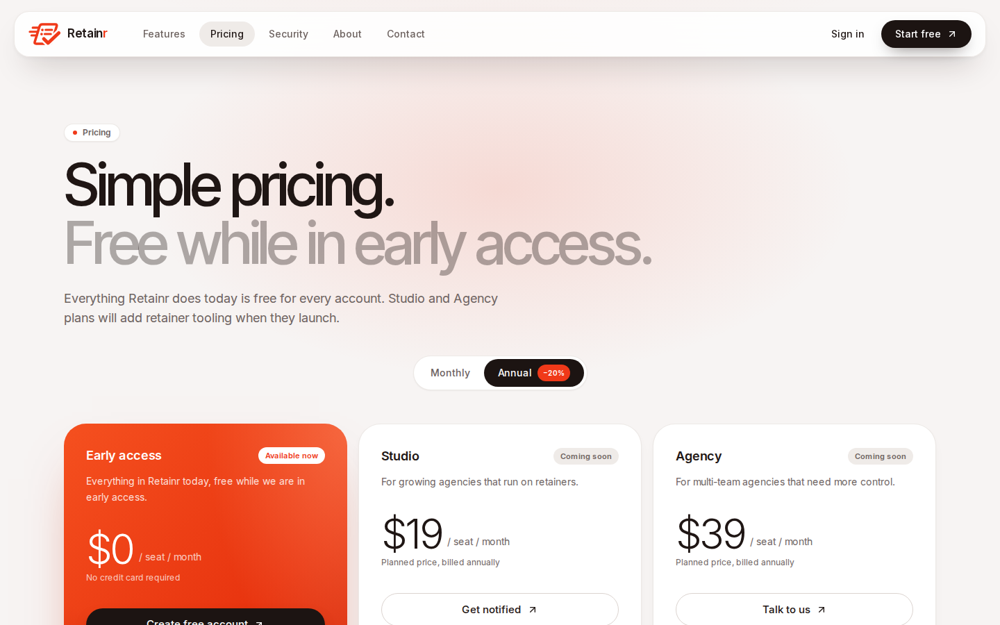 |
| 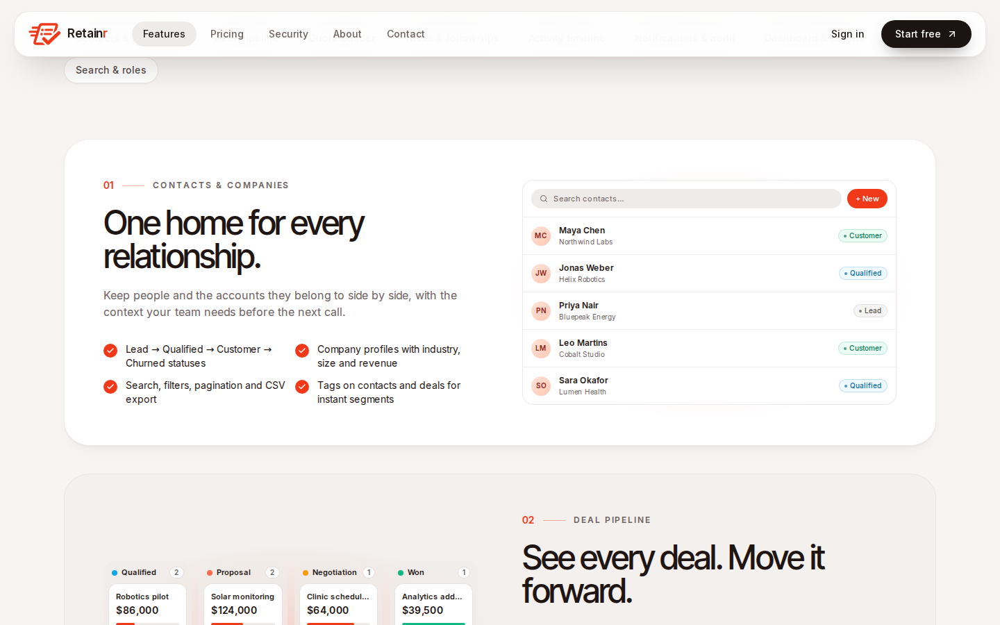 | 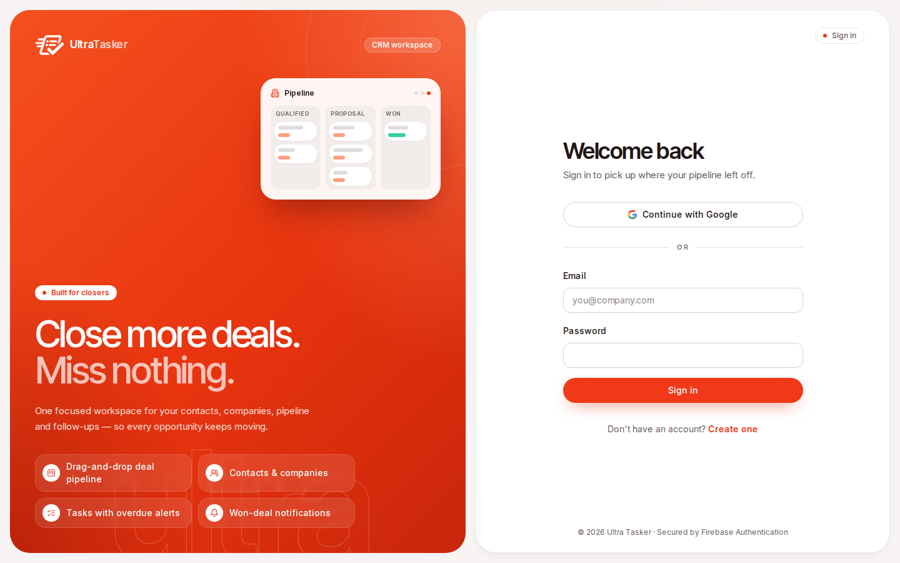 |

**Workspace** — sidebar navigation, no top bar

| | |
|---|---|
| 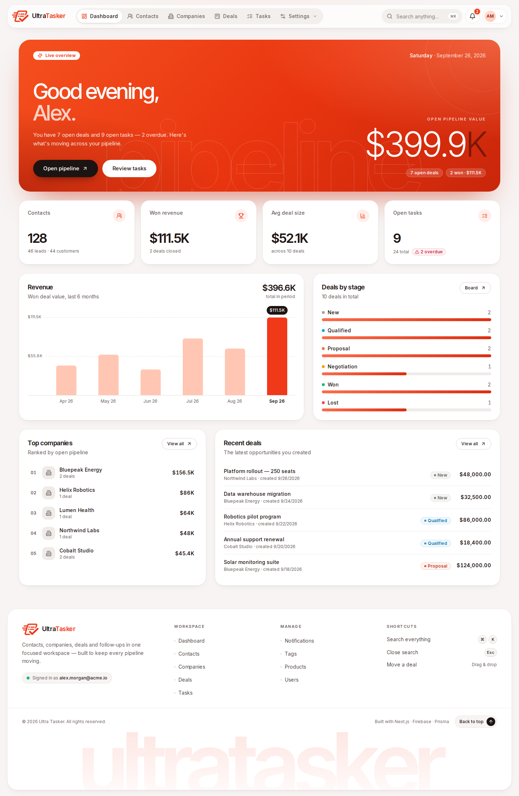 | 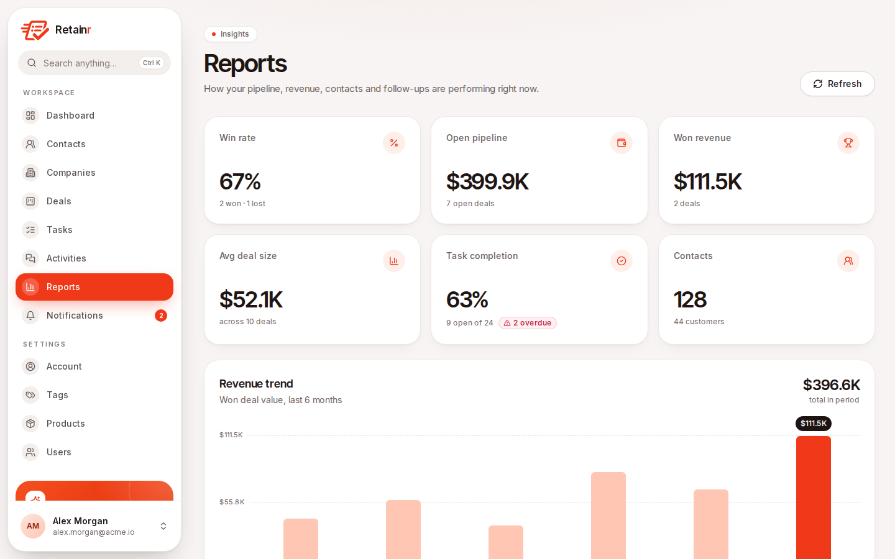 |
| 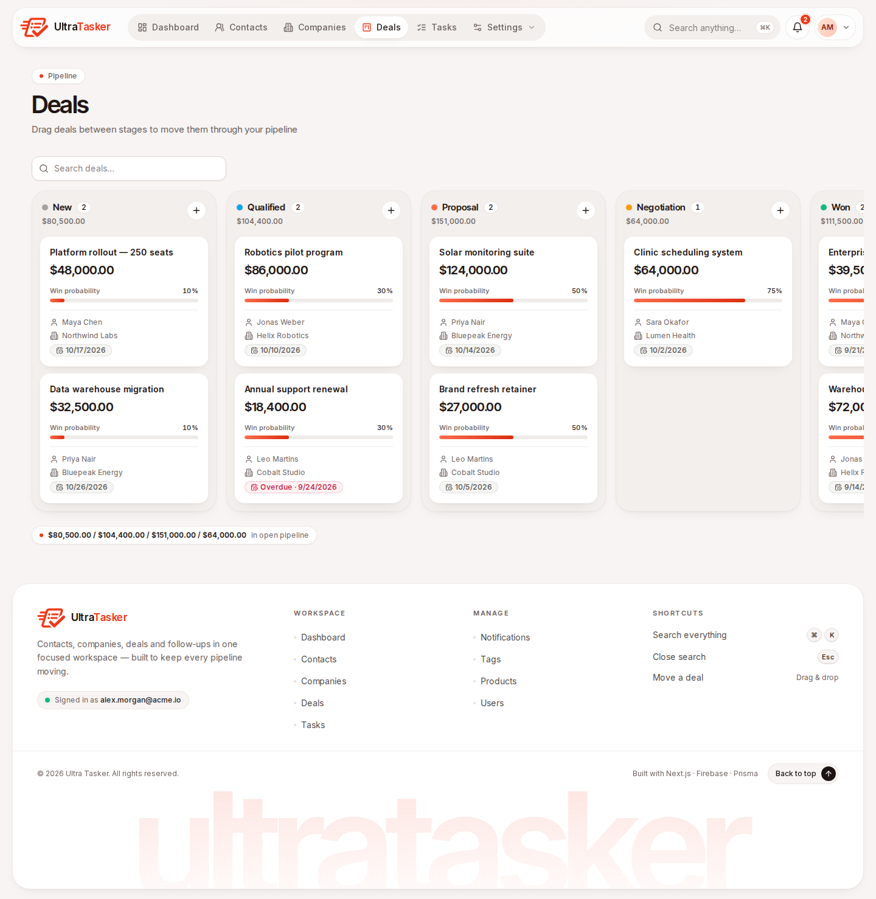 | 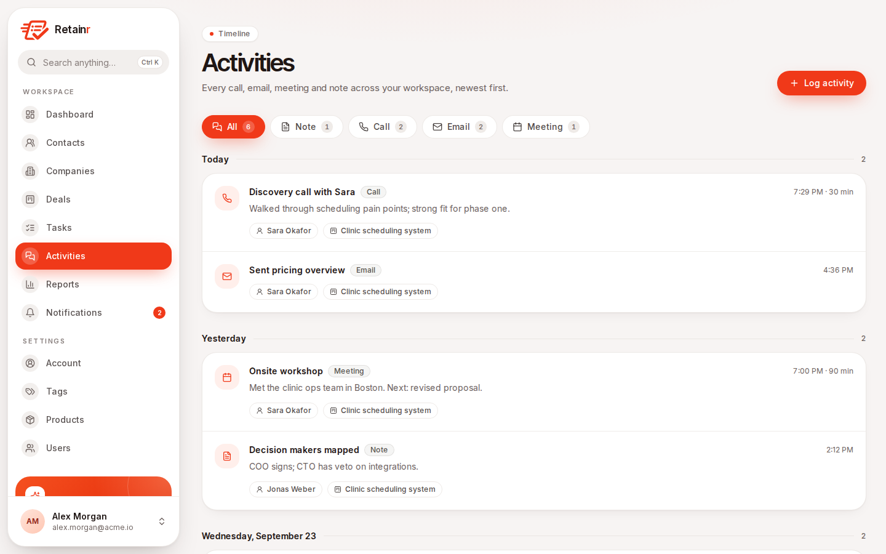 |
| 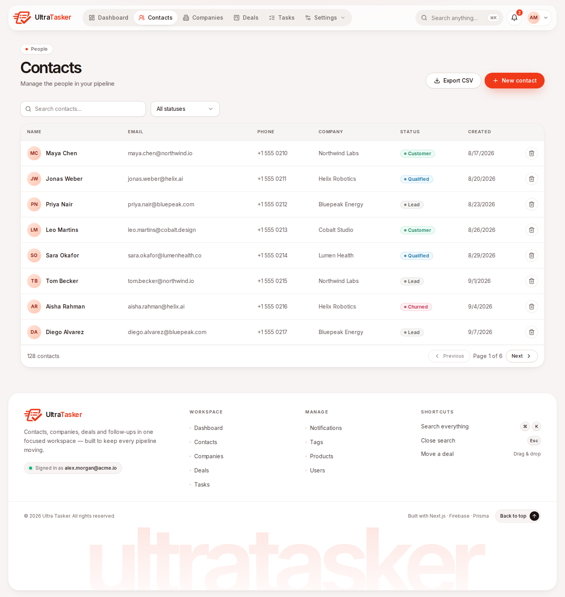 | 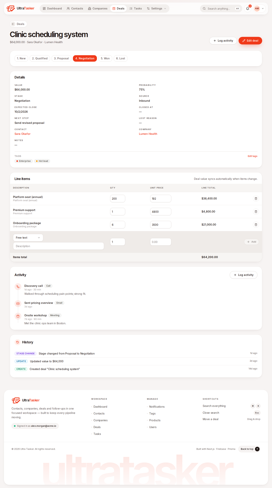 |

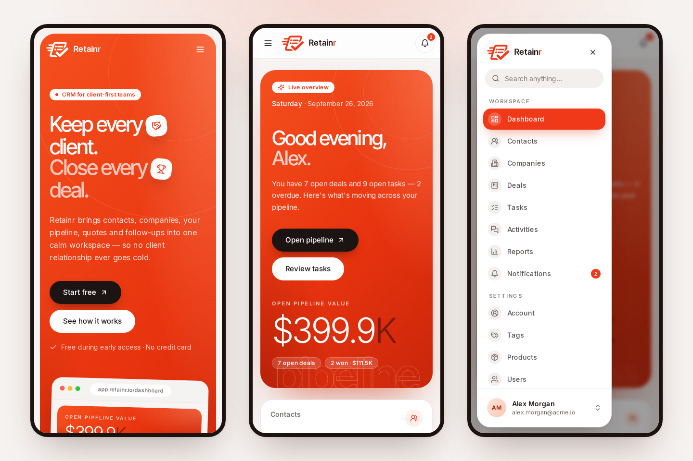

## Features

- **Public website** — home, features, pricing, security, about and contact pages (server-rendered, SEO metadata); works even before Firebase is configured
- **Auth** — Firebase Authentication (email/password + Google OAuth); the API verifies Bearer ID tokens on every request; ADMIN/MEMBER roles via custom claims
- **Contacts** — CRUD with statuses, sources, company links, tags, search + pagination, CSV export
- **Companies** — profiles with industry, size, revenue; detail view with contacts and deals
- **Agency pipeline** — Lead → Discovery → Scope sent → Client review → Won/Lost. Stored enum values stay `NEW`, `QUALIFIED`, `PROPOSAL`, `NEGOTIATION`, `WON`, `LOST` for existing data.
- **Engagements** — project or retainer, one-time and monthly values, service/renewal/review dates, renewal health and probability, loss and churn reasons
- **Quote builder** — product catalog, base/package/add-on line items, and paid ads, SEO, and website/maintenance templates. Template prices are examples in the deal's currency; review them before sharing.
- **Shareable proposals** — immutable quote snapshots, expiring random links, read-only client view, package/add-on selection, viewed/accepted/declined tracking. Acceptance marks the deal won at the selected quote total.
- **Activities** — notes, calls, emails, meetings on a timeline per contact/deal; contacts track last-touch time
- **Tags** — colored tags on contacts and deals, managed in Settings
- **Tasks** — activities linked to contacts/deals, priorities, due dates, overdue tracking, quick-complete; won deals create five idempotent onboarding handoffs
- **Notifications** — in-app bell with unread count; deal-won, overdue-task, renewal-due and at-risk reminders (deduped and synced when dashboard/notifications loads)
- **Audit trail** — every create/update/delete/stage-change recorded per record, visible on detail pages
- **Global search** — one box across contacts, companies and deals
- **Dashboard** — pipeline value, won value, avg deal size, 6-month revenue trend, stage distribution, top companies, tasks due soon, recent activity
- **Reports** — win rate, revenue trend, pipeline by stage, contact mix, task health and top companies
- **Renewals** — 30/60/90-day views, missed renewals, inactive accounts, overdue onboarding, account health, MRR and weighted renewal forecast by currency
- **Activity feed** — every call, email, meeting and note across the workspace, grouped by day and filterable by type
- **Account** — profile, role, sign-in method, password reset and sign-out
- **User management** — ADMINs can list users and change roles
- **Production hygiene** — Helmet, CORS allow-list, rate limiting, compression, Pino structured logs, validation, error envelope, graceful shutdown

## Architecture

| Layer | Stack |
|-------|-------|
| Backend | Node 22.12+, Express, TypeScript (strict), Zod |
| Data | PostgreSQL + Prisma ORM behind repository classes |
| Auth | Firebase Admin (token verification, custom claims) |
| DI | Constructor injection wired in a single composition root (`backend/src/container.ts`) |
| Frontend | Next.js 16 (App Router) + React 18 + TypeScript, Tailwind CSS |
| Client data | `features/*/api` (pure fetch functions) → `features/*/hooks` (React Query) → `components` (render only) |
| DnD | @hello-pangea/dnd (maintained react-beautiful-dnd fork) |

### Domain model map

```
User (Firebase UID, role)
 ├── Company  ──< Contact ──< Deal >── Company
 │                │  └──< Task >──────┘
 │                ├──< Activity (NOTE/CALL/EMAIL/MEETING, also on Deal/Company)
 │                └──< Tag (M2M, also on Deal)
 ├── Product ──< DealItem >── Deal          ← quote builder, base/package/add-on choices
 ├── Deal ──< Proposal                     ← immutable snapshot, expiring token
 └── Notification (task, won, renewal and risk alerts, deduped)

AuditLog (CREATE/UPDATE/DELETE/STAGE_CHANGE per entity, owner-scoped)
```

Every record is scoped by `ownerId` — users only ever see their own CRM data. Full rules: [`ARCHITECTURE.md`](ARCHITECTURE.md). Agent workflows: [`AGENTS.md`](AGENTS.md) and [`SKILLS.md`](SKILLS.md).

## Getting Started

### Prerequisites

- Node.js 22+
- PostgreSQL (local, Docker, or free tier on [Neon](https://neon.tech) / [Supabase](https://supabase.com))
- A Firebase project (free)

### 1. Firebase setup (~5 minutes)

1. Create a project at https://console.firebase.google.com
2. **Authentication → Sign-in method**: enable *Email/Password* and *Google*
3. **Project settings → Service accounts → Generate new private key** — download the JSON
4. **Project settings → General → Your apps → Web app** — copy the config values (`apiKey`, `authDomain`, etc.)

### 2. Backend

```bash
cd backend
cp .env.example .env    # fill in DATABASE_URL + Firebase values below
npm install
npx prisma migrate dev  # creates schema
npm run dev             # API on http://localhost:4000
```

In `backend/.env`:

- `DATABASE_URL` — your Postgres connection string (add `?sslmode=require` for Neon/Supabase)
- Firebase credentials — either paste the whole service-account JSON into `FIREBASE_SERVICE_ACCOUNT_KEY` (single line), fill `FIREBASE_PROJECT_ID` / `FIREBASE_CLIENT_EMAIL` / `FIREBASE_PRIVATE_KEY` (keep the `\n` escapes), or set `GOOGLE_APPLICATION_CREDENTIALS` to a service-account key-file path
- `BOOTSTRAP_ADMIN_EMAILS` — comma-separated; these emails get ADMIN on first login

Optional demo data:

```bash
npm run db:seed
```

> The seed replaces all CRM records owned by `SEED_OWNER_UID` (defaults to a placeholder). Use a demo account. To see the data, sign in once, grab your Firebase UID, and set `SEED_OWNER_UID` before seeding.

### 3. Frontend

```bash
cd frontend
cp .env.example .env    # paste your Firebase web-app config
npm install
npm run dev             # app on http://localhost:3000
```

> The frontend runs on port 3000 — make sure `CORS_ORIGIN` in `backend/.env` includes `http://localhost:3000`.

### 4. First login

Sign up in the app with an email listed in `BOOTSTRAP_ADMIN_EMAILS` — you'll get the ADMIN role and access to user management.

## Scripts

| Command | Where | Description |
| ------- | ----- | ----------- |
| `npm run dev` | `backend` | Dev server with watch (port 4000) |
| `npm run build` / `npm start` | `backend` | Compile / run production build |
| `npm run typecheck` | both | `tsc --noEmit` |
| `npm run lint` | both | ESLint |
| `npm test` / `npm run test:unit` | `backend` | Vitest unit tests with fake repositories (no DB needed) |
| `npm run test:integration` / `npm run test:e2e` | `backend` | Database-backed API integration tests — needs a scratch Postgres: `docker run -d --name retainr-pg -e POSTGRES_PASSWORD=postgres -e POSTGRES_DB=ultra_tasker -p 5434:5432 postgres:16-alpine` then `npx prisma migrate dev` |
| `npm run test:regression` | `backend` | Regression tests for critical route ordering and owner-isolation boundaries (uses the same scratch Postgres) |
| `npx prisma migrate dev` | `backend` | Apply schema changes |
| `npx prisma migrate deploy` | `backend` | Apply committed migrations to an existing deployment |
| `npm run db:seed` | `backend` | Demo data |
| `npm run db:studio` | `backend` | Prisma Studio |
| `npm run dev` / `build` / `start` / `lint` / `typecheck` | `frontend` | Next.js app |

## Continuous integration

GitHub Actions runs separate workflows for relevant pull requests and pushes to `main`:

- **Backend** — typecheck, unit, integration, and regression tests, then production build, against PostgreSQL 16.
- **Frontend** — typecheck and production build.
- **Lint** — ESLint for both workspaces.

## API Overview

Base URL: `/api/v1` · Auth: `Authorization: Bearer <Firebase ID token>` except health and public proposal routes · Envelope: `{ "data": ... }` / `{ "error": { "code", "message" } }`

| Method | Endpoint | Description |
| ------ | -------- | ----------- |
| GET | `/health` | Liveness (no auth) |
| POST | `/auth/session` | Sync profile, returns current user |
| GET / PATCH | `/users`, `/users/:id/role` | List users / change role (ADMIN) |
| GET / POST / PATCH / DELETE | `/contacts[/:id]` | Contacts CRUD (search, status, pagination) |
| GET | `/contacts/export` | CSV download |
| PATCH | `/contacts/:id/tags` | Replace contact tags |
| GET / POST / PATCH / DELETE | `/companies[/:id]` | Companies CRUD |
| GET / POST / PATCH / DELETE | `/deals[/:id]` | Deals CRUD (stage changes trigger close/probability logic) |
| PATCH | `/deals/reorder` | Kanban reorder (batch stage + position) |
| GET / POST | `/deals/templates`, `/deals/:id/template` | List and add agency quote templates |
| PATCH | `/deals/:id/tags` | Replace deal tags |
| POST / PATCH / DELETE | `/deals/:id/items[/:itemId]` | Quote line items (auto-recalc deal value) |
| GET / POST | `/proposals?dealId=`, `/proposals` | List and create owner-scoped proposal snapshots; creation returns the share token once |
| GET / POST | `/proposals/public/:token`, `/proposals/public/:token/respond` | Public read and client decision; no Firebase token required |
| GET / POST / PATCH / DELETE | `/tasks[/:id]` | Tasks CRUD |
| GET / POST / PATCH / DELETE | `/tags[/:id]` | Tag CRUD |
| GET / POST / PATCH / DELETE | `/products[/:id]` | Product catalog CRUD |
| GET / POST / PATCH / DELETE | `/activities[/:id]` | Activity timeline CRUD |
| GET | `/notifications` | List + unread count (syncs overdue-task and renewal alerts) |
| POST | `/notifications/read` | Mark read (ids or all) |
| GET | `/search?q=` | Global search |
| GET | `/audit?entityType=&entityId=` | Audit trail for a record |
| GET | `/dashboard/stats` | Dashboard, renewals and operating metrics; syncs renewal alerts |

## Project Structure

```
├── AGENTS.md / SKILLS.md / ARCHITECTURE.md   # engineering harness + architecture laws
├── backend/
│   ├── prisma/            # schema.prisma, migrations, seed
│   └── src/
│       ├── config/        # Zod-validated env
│       ├── common/        # middleware (auth, errors), utils, audit/notification ports
│       ├── database/      # Prisma + Firebase Admin singletons
│       ├── features/      # auth, users, contacts, companies, deals, tasks,
│       │                  # tags, products, activities, notifications, audit, search, dashboard, proposals
│       │   └── <name>/    # router → controller → service → repository + schemas
│       ├── container.ts   # DI composition root
│       └── app.ts / main.ts
└── frontend/
    ├── app/                 # App Router: layouts, route groups, thin page.tsx views
    │   ├── (site)/          # public website: /, /features, /pricing, /security, /about, /contact
    │   ├── (auth)/          # /login, /signup (public)
    │   └── (crm)/           # auth-guarded sidebar shell: /dashboard, /contacts, /deals, /renewals, /tasks, /activities, /reports, /settings/*
    └── src/
        ├── features/<name>/ # api/ (pure fetch, .ts) → hooks/ (React Query, .ts) → components/ (.tsx)
        └── shared/          # api-client, firebase, UI primitives, audit timeline, types
```

## Roadmap

- [ ] Playwright smoke tests
- [ ] CSV import (export is live)
- [ ] Email reminders for overdue tasks
- [ ] Workspace migration after solo-agency validation (workspace ownership, membership and roles)
- [ ] Optional payments, e-signature, calendar/email sync, and client portal after workflow validation

## Contributing

Contributions welcome — read [`AGENTS.md`](AGENTS.md) first; the architecture laws apply to every PR.

## Author

Vishnu Vardhan Vemula — [GitHub](https://github.com/vishnu-vemula)
